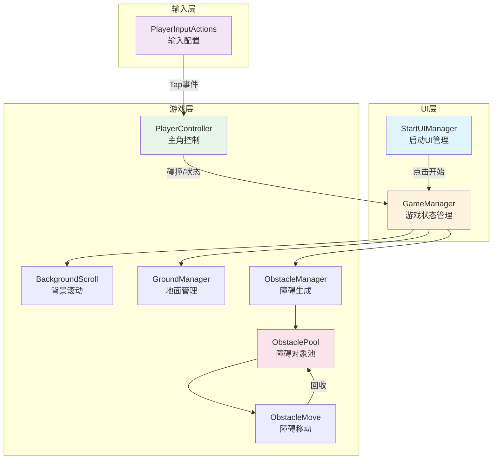
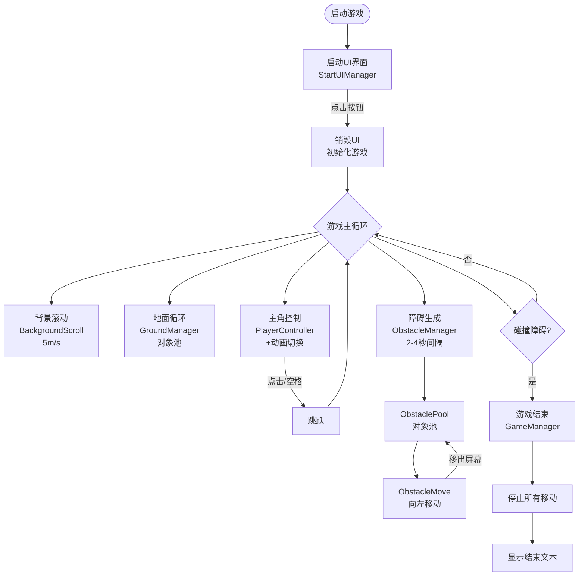

# 冰火冲冲冲 (Dash: Fire & Ice)

一款基于团结引擎开发的 2D 横版无尽跑酷游戏，目标平台为鸿蒙 (OpenHarmony)。

---

## 项目概述

| 属性 | 值 |
|------|-----|
| **游戏类型** | 2D 横版无尽跑酷 |
| **开发引擎** | 团结引擎 1.6.8 (Unity 2022.3.61t9) |
| **开发语言** | C# |
| **目标平台** | OpenHarmony (鸿蒙 API 9+) |
| **输入系统** | Unity Input System 1.14.0 |

---

## 核心玩法

- **操作**：点击屏幕/空格键跳跃
- **目标**：躲避障碍物，尽可能跑得更远
- **失败条件**：碰到障碍物即游戏结束

---

## 项目结构

```
dash-fire-and-ice/
├── Assets/
│   ├── Scenes/                    # 场景文件
│   │   └── GameScene.unity        # 主游戏场景
│   ├── Scripts/                   # C# 脚本
│   ├── InputSystem/               # 输入配置
│   │   └── PlayerInputActions.inputactions
│   ├── Prefabs/                   # 预制体 (需手动创建)
│   └── Animations/                # 动画资源 (需手动创建)
├── ProjectSettings/               # 项目配置
└── Packages/                      # 包管理
```

---

## 脚本架构

### 核心脚本 (9 个)



### 脚本清单

| 脚本文件 | 功能说明 | 挂载对象 | 依赖 |
|----------|----------|----------|------|
| `StartUIManager.cs` | 启动UI管理，处理开始按钮点击 | UI_Start Canvas | Button |
| `GameManager.cs` | 游戏状态管理 (单例) | GameManager | 所有其他脚本 |
| `PlayerController.cs` | 主角控制 (跳跃、动画) | Player_Ice | InputSystem, Animator |
| `BackgroundScroll.cs` | 背景循环滚动 | BG_Scroll | 无 |
| `GroundManager.cs` | 地面循环生成 (对象池) | GroundManager | Ground 预制体 |
| `ObstaclePool.cs` | 障碍对象池 | ObstaclePool | Obstacle 预制体 |
| `ObstacleManager.cs` | 障碍生成控制 | ObstacleManager | ObstaclePool |
| `ObstacleMove.cs` | 障碍移动 | Obstacle 预制体 | ObstaclePool |
| `ButtonScale.cs` | 按钮缩放反馈 | Button | EventSystem |

---

## Unity 层级 (Layers)

| 层名 | 用途 |
|------|------|
| **Player** (8) | 主角角色 |
| **Obstacle** (9) | 障碍物 |
| **Ground** (10) | 地面 |
| **UI** (5) | 界面元素 |

---

## 场景搭建指南

### 当前场景结构

```
GameScene
├── Main Camera
│   ├── Camera (Orthographic, Size: 5)
│   └── AudioListener
├── BG_Scroll (空对象，需手动添加子对象)
├── GameManager (空对象，需挂载 GameManager.cs)
└── [待添加]
    ├── UI_Start (Canvas + Button)
    ├── Player_Ice (Sprite + 组件)
    ├── Ground_Parent (地面父对象)
    └── ObstaclePool (障碍对象池)
```

### 待手动创建的对象

#### 1. 启动 UI (T2)

```
UI_Start (Canvas, Render Mode: Screen Space - Overlay)
├── Background (Image, 深绿色背景)
└── Btn_StartGame (Button)
    ├── ButtonScale.cs
    └── Text (TextMeshPro: "开始游戏")
```

**StartUIManager 配置**：
- `btnStartGame` → 拖拽 Btn_StartGame
- `uiStartRoot` → 拖拽 UI_Start

#### 2. 主角对象 (T4)

```
Player_Ice
├── Sprite Renderer (Unity 内置 Square Sprite, 蓝色)
├── Rigidbody2D
│   ├── Gravity Scale: 2
│   ├── Freeze Rotation: ✓
│   └── Constraints: Freeze Position X
├── BoxCollider2D
├── Animator (Controller: Player_Ice_Animator)
└── PlayerController.cs
```

**PlayerController 配置**：
- `jumpSpeed`: 7

#### 3. 地面系统 (T3)

```
Prefab_Ground (预制体)
├── Sprite Renderer (浅棕色 Square Sprite)
├── BoxCollider2D
└── Rigidbody2D (Body Type: Static)

GroundManager (空对象)
└── GroundManager.cs
    ├── groundPrefab → 拖拽 Prefab_Ground
    └── groundPoolCount: 3
```

#### 4. 障碍系统 (T6)

```
Prefab_Obstacle (预制体)
├── Sprite Renderer (灰色 Square Sprite)
└── BoxCollider2D

ObstaclePool (空对象)
└── ObstaclePool.cs
    ├── obstaclePrefab → 拖拽 Prefab_Obstacle
    └── poolSize: 5

ObstacleManager (空对象)
└── ObstacleManager.cs
    └── obstaclePool → 拖拽 ObstaclePool 对象
```

#### 5. 动画控制器 (T4)

```
Player_Ice_Animator (Animator Controller)
├── Idle (动画状态)
├── Run (动画状态, 默认)
├── Jump (动画状态)
├── Die (动画状态)
└── Parameters (Bool 类型):
    ├── isRunning
    ├── isJumping
    └── isDead
```

---

## 输入配置

### PlayerInputActions 结构

```
Gameplay (Action Map)
├── Tap (Button Action)
│   ├── Touchscreen/Press
│   └── Mouse Left Button
└── Jump (Button Action)
    └── Keyboard/Space
```

---

## 游戏流程



---

## 调试指南

### 常见问题排查

| 问题 | 可能原因 | 解决方案 |
|------|----------|----------|
| 脚本编译报错 | Input System 未正确生成 | Reimport Input Actions 文件 |
| 角色掉出屏幕 | 地面碰撞体未正确设置 | 检查 Ground 层与 Player 层的碰撞矩阵 |
| 障碍不生成 | ObstaclePool 引用未连接 | 在 Inspector 中拖拽赋值 |
| 按钮无响应 | EventSystem 未添加 | 检查场景中是否有 EventSystem |
| 动画不切换 | Animator Controller 参数未设置 | 检查 Parameters 和 Transitions |

### Debug 日志

在脚本中已添加的关键 Log：

```csharp
// StartUIManager.cs:31
Debug.Log("开始游戏，启动UI已销毁");

// GameManager.cs:48
Debug.Log("游戏结束");
```

### 性能监控

- 目标帧率：60 FPS
- 内存占用：≤ 200MB
- 对象池大小：地面 3 个，障碍 5 个

---

## 鸿蒙平台打包

### 配置步骤

1. **切换平台**
   ```
   File → Build Settings → OpenHarmony → Switch Platform
   ```

2. **Player Settings 配置**
   ```
   Product Name: IceFireDashDemo
   Package Name: com.demo.icefiredash
   Minimum API Level: API 9
   ```

3. **构建**
   ```
   Build → Build (选择纯英文路径)
   ```

4. **DevEco Studio 打包**
   ```
   导出 .ohosproj → 配置签名 → Build HAP
   ```

---

## 开发待办

基于 `specification.md` 中的任务清单：

- [x] T1: 项目基础配置
- [x] T2: 启动界面开发 (需场景搭建)
- [x] T3: 游戏场景搭建 (需场景搭建)
- [x] T4: 主角对象创建 (需场景搭建)
- [x] T5: 主角运动与动画逻辑 (需场景搭建)
- [x] T6: 障碍系统开发 (需场景搭建)
- [x] T7: 碰撞检测与游戏结束 (需场景搭建)
- [ ] T8: 鸿蒙适配与本地运行验证

---

## 技术要点

### 分辨率适配

所有尺寸计算使用 `Screen.width/height` 并转换为 Unity 世界单位：

```csharp
float meters = pixels / Screen.dpi * 0.0254f; // 像素转米
```

### 对象池模式

地面和障碍都使用对象池避免频繁创建/销毁：

```csharp
Queue<GameObject> pool = new Queue<GameObject>();
// 取出
GameObject obj = pool.Dequeue();
// 放回
pool.Enqueue(obj);
```

### 单例模式

GameManager 使用单例模式：

```csharp
public static GameManager Instance { get; private set; }
```

---

## 参考资料

- [团结引擎官方文档](https://tuanjie.cn/)
- [Unity Input System 文档](https://docs.unity3d.com/Packages/com.unity.inputsystem@1.14)
- [鸿蒙开发指南](https://developer.huawei.com/consumer/cn/)

---

**更新时间**: 2024-12-28
**版本**: 0.1.0
